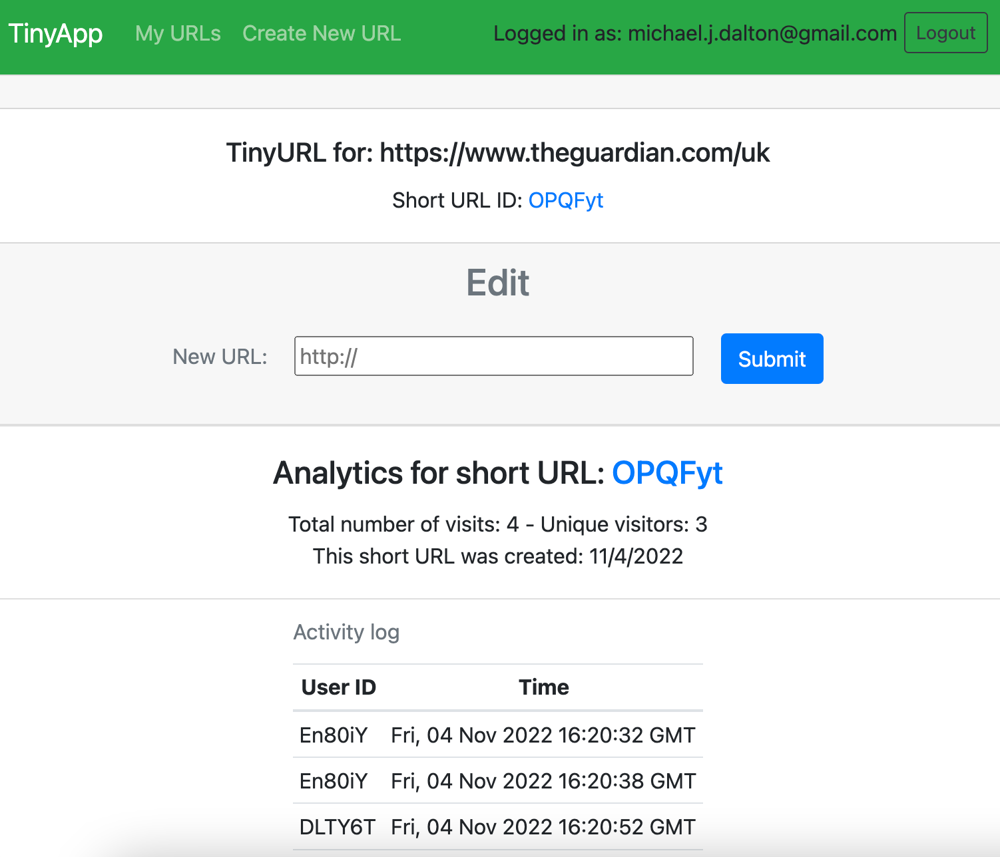
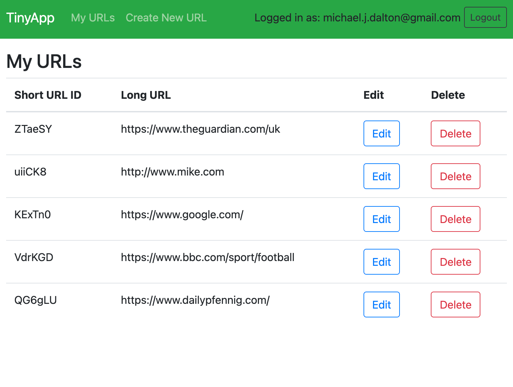

# TinyApp

TinyApp is a full stack web application built with Node and Express that allows users to shorten long URLs (à la bit.ly).

Using Express as it's template engine, the site gives users the ability to create password protected accounts which they can log in to and out of.  Short URLs can be created, deleted and updated, while analytics of each short URL use are logged.

## Purpose

This project is part of my learnings at Lighthouse Labs.

## Final Product

## Dependencies

* Node.js
* Express
* EJS
* bcryptjs
* cookie-session
* method-override
* morgan

## Usage

The web site is currently configured as follows:

* IP address: localhost (127.0.0.1).

* Port: 8080.

## Getting Started

* Install all dependencies (using the `npm install` command).

* Run the development web server using either the `node express_server.js` or `npm start` command.

## Documentation

The following files have been developed for the web site:

* `express_server.js`: provides the web server functionality and also a pseudo 'back-end' database of objects.  The configuration, route handlers and listeners are contained within.

* `helpers.js`: contains the helper functions called within the routes of the express_server.js module.

### test

* `helpersTest.js`: unit testing of the helper functions using Mocha and Chai.

### views

* `urls_index.ejs`: shows a list of the current short URLs and their associated long URLs, with options to edit or delete these resources.

* `urls_login.ejs`: enables user to enter email and password to log in to the site.

* `urls_new.ejs`: will create a new short URL for any long URL entered by the user.

* `urls_register.ejs`: a user may create an account upon entering their email and choosing a password.

* `urls_show.ejs`: a user may edit a long URL here and test the short URL link, which will redirect the user to the web site specified by the long URL.

### views/partials

* `_header.ejs`: contains the navigation links to the site.  When a user is signed-in, it will show 'logged in as <user's email address>' with a button to log out if desired.